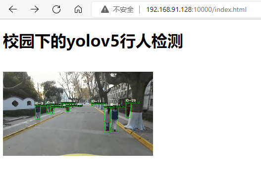

# WebServer
**项目名称：基于linux的多线程图片浏览HTTP服务器**

**项目介绍：**

1.使用 线程池 + 非阻塞socket + epoll(LT实现) + 事件处理(模拟Proactor实现) 的并发模型；

2.使用状态机解析HTTP请求报文，支持解析GET请求；

3.访问服务器数据库，可以请求服务器图片和视频文件；

4.使用Webbench进行压力测试。

**快速运行：**

**step1：** 服务器测试环境：Ubuntu版本18.04；

**step2：** 浏览器测试环境：Windows、Linux均可；

**step3：** **编译指令：** g++ *.cpp -pthread；

**step4：** **运行指令：** ./a.out port；

**step5：** **浏览器访问：** http://ip:port/index.html  

其中ip为服务器端IP地址，port为端口号。

**step6：** **压力测试指令：** ./webbench -c 1000 -t 5 http://ip:port/index.html  

其中c表示客户端数，t表示时间，ip为服务器端IP地址，port为端口号。

**运行结果：成功访问界面** 

